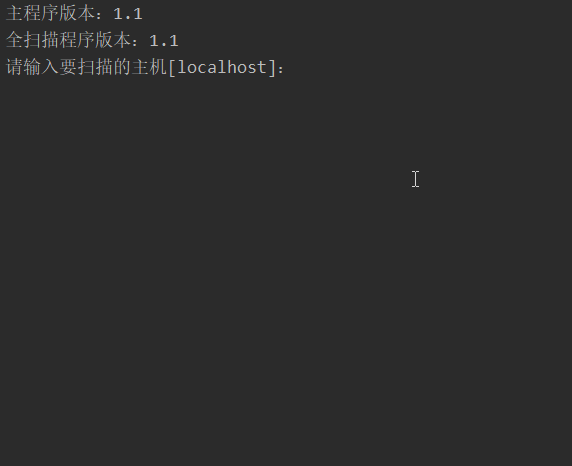

# PortScanner 端口扫描器

## 功能

### 多线程扫描，可设置线程数

### 可以设置连接超时时间

程序基于 Socket 连接是否超时，来判断目标端口是否开启或关闭。如果在超时时间内目标有响应，则认定为端口开启，否则认为端口关闭。这个超时时间

### 4 种端口扫描内容

-   扫描所有端口
-   扫描常用端口
-   扫描指定范围内端口
-   扫描指定端口

### 扫描方式

#### 全连接扫描

核心代码

```java
try {
    int port = 22;
	Socket socket = new Socket();	// 创建 Socket
	InetSocketAddress isa = new InetSocketAddress(inetAddress, port);
	socket.connect(isa, 1000);		// 连接目标 
	socket.close();
	System.out.printf("%s:%5d is opened\n", inetAddress, port);
} catch (IOException e) {
    // 如果端口关闭，会抛出异常显示连接超时
	System.err.printf("%s:%5d is closed\n", inetAddress, port);
}
```

如果端口关闭，则在连接时，会抛出 `IOException`，错误信息是：`connect timed out`。

#### 使用 JPCAP 来创建 TCP 数据包

##### 配置 JPCAP

[java利用Jpcap实现抓包](https://blog.csdn.net/qq_37493888/article/details/79330167)

[jpcap.dll 和 jpcap.jar](https://github.com/HuangFangyuan/Jpcap-master/tree/master/%E9%85%8D%E7%BD%AE%E6%96%87%E4%BB%B6)

[jpcap安装与配置](https://www.cnblogs.com/caroar/archive/2011/10/12/2208196.html)

## 用法

下载发布的 jar 包

```cmd
java -jar PortScanner-*.jar
```

然后按照提示输入信息

